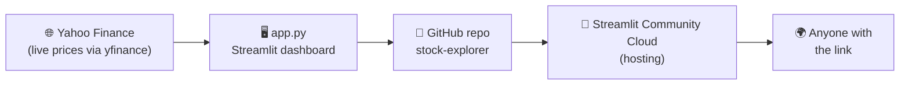

# 📈 Stock Explorer

An interactive web app for comparing how companies' stocks have grown over time, using
**live market data**. Search any company, compare it against others over decades, and see
what an investment would be worth today. Built with [Streamlit](https://streamlit.io) and
[Plotly](https://plotly.com), and driven end-to-end through Claude using MCP "skill packs."

**🌐 Live app:** https://stock-explorer-adam.streamlit.app/

---

## What it does

Search for any company by name or ticker, add it to your comparison, and the app pulls its
full price history and plots it. Every line is indexed to 1.00 at the start of your chosen
window, so the chart shows growth on a level playing field.

Features:

- **🔎 Live search** — type a company name or ticker; the app looks it up and fetches its data.
- **📅 Date range back to ~2000** — zoom into any window; prices re-index to its start.
- **🏆 Best performer** — instantly see which selected stock grew the most.
- **🌪️ Most volatile** — see which stock bounced around the most (daily-return volatility).
- **💸 "What if I invested?" calculator** — enter an amount and see what it would be worth today.
- **📊 Line + bar charts** — growth over time and total growth side by side.
- **🎨 Brand-colored lines** — Netflix red, Nvidia green, Amazon orange, and a dark theme.
- **💡 Rotating "Did you know?" facts** — eight real facts that cycle every 15 seconds, client-side.

Live prices come from **Yahoo Finance** via the [`yfinance`](https://pypi.org/project/yfinance/)
library — no API key required.

---

## Architecture



The app fetches live prices from Yahoo Finance at runtime. The code lives in a public
GitHub repo, Streamlit Community Cloud builds and hosts it straight from that repo, and
anyone with the link can open it in a browser.

---

## Run it locally

```bash
pip install -r requirements.txt
streamlit run app.py
```

Then open the local URL Streamlit prints (usually http://localhost:8501).

---

## Project structure

```
stock-explorer/
├── app.py              # the Streamlit app
├── requirements.txt    # streamlit, pandas, plotly, yfinance
├── .gitignore          # keeps secrets out of git
├── .streamlit/
│   └── config.toml     # custom dark theme
└── README.md           # this file
```

---

## Built with MCP skill packs

This project was assembled by driving Claude through Model Context Protocol servers:

| Skill pack | What it did here |
|------------|------------------|
| **Context7** 📚 | Pulled up-to-date Streamlit / Plotly / yfinance API usage while coding features. |
| **Fetch** 🌐 | Looked up the real-world "Did you know?" facts shown in the app. |
| **GitHub** 🐙 | Created the public repo and pushed the project. |
| **Playwright** 🎭 | Opened the deployed live app and captured a screenshot to prove it works. |
| **Mermaid** 🧜 | Generated the architecture diagram above. |
| **Filesystem** 📁 | Read and wrote the project files. |

---

## Reflection

The MCP that helped most was **GitHub** — going from a local folder to a live, public repo
without leaving the chat removed the step that usually trips people up. What surprised me
most was how little plumbing a *real* live app needed: decades of market data came from
Yahoo Finance with **no API key**, and the rotating fun-fact runs entirely in the browser,
so it refreshes every 15 seconds without ever reloading the page. Driving the whole pipeline
(code → repo → deploy → screenshot) through plain-English requests felt less like programming
and more like delegating.
